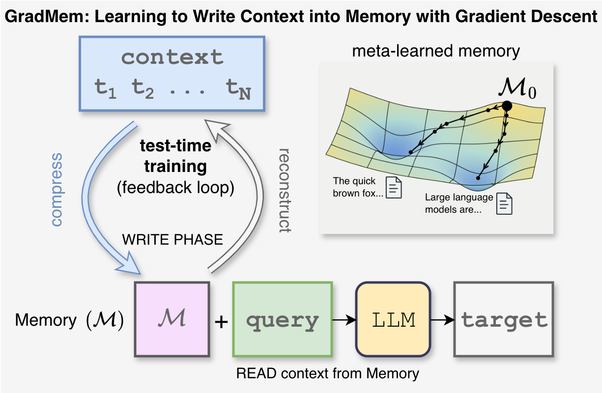

# GradMem: Learning to Write Context into Memory with Test-Time Gradient Descent

This repository contains code for **GradMem**, a memory mechanism where the model compresses a context into a small writable memory state using **test-time gradient descent**.

The key idea is not just to optimize memory at inference, but to **meta-learn the model so that a few (<=5) test-time updates are effective**.

arXiv: https://arxiv.org/abs/2603.13875

<p align="center">
  
</p>

## Concept

Each example is split into:
- `context C` (information to store),
- `query Q` (what to ask),
- `target Y` (expected output).

GradMem runs in two phases:

1. **WRITE (inner loop, K steps)**
   - Start from learned memory initialization `M0`.
   - Optimize memory tokens `M` on a self-supervised reconstruction loss `L_write(M, C)`.
   - Update only memory state; model weights stay fixed during this phase.

2. **READ (outer objective)**
   - Predict `Y` from `[M; Q]` after WRITE.
   - Train model parameters and `M0` by backpropagating task loss through the WRITE updates (meta-learning).

In short: GradMem learns to use gradient descent itself as a writing operation.

## Repository layout

- `grad_memgpt.py` - GradMem model and inner-loop memory optimization logic.
- `rmt.py` - recurrent memory transformer baseline with forward-only memory updates.
- `run_gradmemgpt_on_*.py` - GradMem training/eval entry points.
- `run_rmt_on_*.py` - RMT baseline entry points.
- `run_gpt2_on_*.py` - non-compressive causal LM baselines.
- `kv_dataset_utils.py` - synthetic key-value retrieval data generation and tokenizer helpers.
- `squad_utils.py`, `phonebook_utils.py` - NLP dataset preprocessing.
- `prepare_pg19_chunks.py` - PG19 chunking for language modeling/compression experiments.
- `attn_double_bwd/` - custom attention double-backward implementations for higher-order GradMem training.
- `scripts/` - runnable experiment presets and dataset download scripts.

## Setup

Requirements:
- Python 3.11
- [conda](https://docs.conda.io/en/latest/)

Create environment:

```bash
conda env create -f conda_env.yaml
conda activate /home/jovyan/kuratov/envs/py311_pt2.6_cu12.4
```

`accelerate.yaml` contains a default single-process setup.

## Data

### KV retrieval

Synthetic samples contain `!key:value!` pairs in context and a query like `?!K:`; target is the corresponding value.

Download prepared datasets from Hugging Face:

```bash
./scripts/download_kv_retrieval.sh
```

You can also generate data with `notebooks/dump_dataset.ipynb` (uses `kv_dataset_utils.generate_sequence`).

The framed MQAR noise datasets can be downloaded with:

```bash
./scripts/download_mqar_noise_datasets.sh
```

### bAbI

```bash
./scripts/download_babi.sh
```

### PG19 chunks (for text compression / LM experiments)

```bash
./scripts/prepare_pg19_chunks.sh
```

## How to run

### 1) Baseline causal LM (no writable memory)

```bash
accelerate launch --config_file accelerate.yaml \
  run_gpt2_on_kv_retrieval.py \
  --exp_path ./runs/gpt2_example \
  --per_device_batch_size 64 \
  --data_path ./data/N16-K2V2-V62_1M \
  --tokenizer_path ./tokenizers/kv_alphabet_62/ \
  --base_model llama
```

### 2) GradMem on KV retrieval

```bash
accelerate launch --config_file accelerate.yaml \
  run_gradmemgpt_on_kv_retrieval.py \
  --exp_path ./runs/gradmem_example \
  --per_device_batch_size 64 \
  --data_path ./data/N16-K2V2-V62_1M \
  --tokenizer_path ./tokenizers/kv_alphabet_62/ \
  --base_model llama \
  --n_mem_tokens 8 \
  --K 2 \
  --inner_lr 0.04 \
  --grad_mode second
```

For full experiment configurations, use scripts in `scripts/`:
- `scripts/run_gradmemgpt_on_kv_retrieval.sh`
- `scripts/run_energygradmem_on_kv_retrieval.sh`
- `scripts/run_rmt_on_kv_retrieval.sh`
- `scripts/run_gpt_on_kv_retrieval.sh`

Enable the training-only EnergyGradMem memory search with environment overrides:

```bash
ENERGY_MEMORY_SEARCH_WEIGHT=0.1 \
ENERGY_MEMORY_SEARCH_NUM_SAMPLES=4 \
ENERGY_MEMORY_SEARCH_RADIUS_SCALE=0.25 \
ENERGY_MEMORY_SEARCH_USE_GAIN_WEIGHTING=true \
ENERGY_MEMORY_SEARCH_GAIN_EMA_DECAY=0.99 \
ENERGY_MEMORY_SEARCH_USE_BEST_FOR_NEXT_STEP=true \
bash scripts/run_energygradmem_on_kv_retrieval.sh
```

The search runs around `M_1...M_K`, preserves each memory's global L2 norm,
and uses a radius equal to `ENERGY_MEMORY_SEARCH_RADIUS_SCALE` times the
preceding WRITE-step displacement. It requires full second-order SGD WRITE.
Gain weighting uses each selected candidate's relative READ-loss reduction and
normalizes positive gains with a persistent EMA updated once per microbatch.
The optional best-for-next-step mode performs search inline and starts the next
training WRITE step from a straight-through copy of the selected memory. After
the final SGD step, READ uses the selected perturbation as its forward memory;
the search loss still attracts the SGD-derived state toward that detached target.
The full training rollout is target-guided, while inference follows the ordinary
query-independent SGD trajectory.

### Cached checkpoint evaluation

`evaluate_energy_shaping.py` stores expensive task and landscape measurements in
`checkpoint-*/energy_shaping_metrics/`. Run it once with `--cache-only` to
precompute checkpoint data, then run later comparisons with the same evaluation
settings and a new `--output-dir`; model and dataset loading are skipped when all
requested caches exist. Use `--recompute-metrics task radial` (or `all`) to
selectively refresh metric families.

Metric families have independent versions in `METRIC_FAMILY_VERSIONS`. When a
stored metric changes, bump only that family's version; adding another family
does not invalidate existing task or landscape measurements.

Precompute every supported checkpoint under `runs/` with:

```bash
conda run -n rmt python scripts/cache_all_energy_shaping_checkpoints.py \
  --runs-dir runs -- --device cpu
```

Arguments after `--` are forwarded to `evaluate_energy_shaping.py`. Use
`--dry-run` before a large sweep, and pass the same evaluation settings that
will be used for later comparisons.
- `scripts/run_gradmemgpt_on_babi.sh`
- `scripts/run_gradmemgpt_on_squad.sh`


For text-compression experiments, prepare PG19 chunks with
`scripts/prepare_pg19_chunks.sh` and run `run_gradmemgpt_on_text_compression.py` directly with `accelerate`.

## GradMem options

`grad_mode` controls gradient flow through WRITE updates:

- `none` - no meta-gradient through inner updates.
- `first` - first-order approximation.
- `second` - full second-order differentiation through inner loop (default for strongest results).

Second-order mode is more expensive in memory/compute, but it is what we found that actually makes GradMem to learn; `attn_double_bwd/` includes optimized double-backward implementations for attention for second-order optimization.

## Outputs

All runs write checkpoints, metrics, and trainer state under `--exp_path` (typically in `./runs/...`).


## Tests

Pytest smoke tests for `GradMemGPT` live in `tests/test_gradmemgpt.py` and cover:

- Model families: `gpt2`, `gpt_neox`, `llama`
- Memory backends: `prefix`, `lora`

Markers:

- `forward`: fast forward-only checks (`test_forward`)
- `one_batch_train`: one optimizer step on a single batch (`test_single_batch_train`)
- `all`: union of `forward` and `one_batch_train`

Examples:

```bash
# Run all smoke tests (forward + one-batch-train)
python -m pytest -q -m all

# Run only forward tests
python -m pytest -q -m forward

# Run only one-batch training tests
python -m pytest -q -m one_batch_train

# Run tests for selected backend(s) only
python -m pytest -q -m all --backend prefix
python -m pytest -q -m all --backend prefix,lora

# Run tests for selected model family/families only
python -m pytest -q -m all --model-family llama
python -m pytest -q -m all --model-family gpt2,gpt_neox

# Combine backend + model-family filters
python -m pytest -q -m all --backend prefix --model-family llama
```

## Citation
```
@misc{kuratov2026gradmem,
      title={GradMem: Learning to Write Context into Memory with Test-Time Gradient Descent}, 
      author={Yuri Kuratov and Matvey Kairov and Aydar Bulatov and Ivan Rodkin and Mikhail Burtsev},
      year={2026},
      eprint={2603.13875},
      archivePrefix={arXiv},
      primaryClass={cs.CL},
      url={https://arxiv.org/abs/2603.13875}, 
}
```
